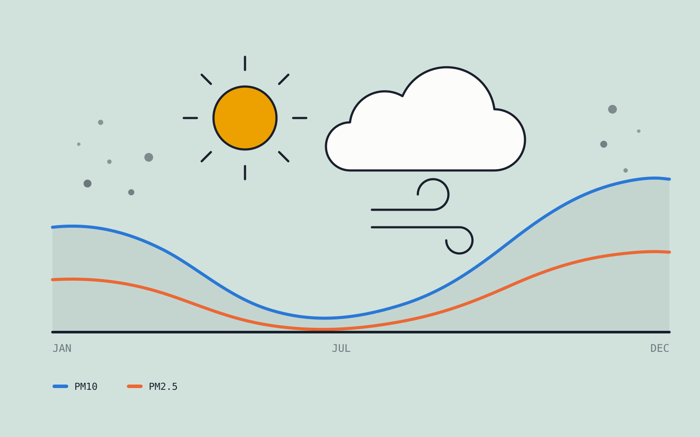
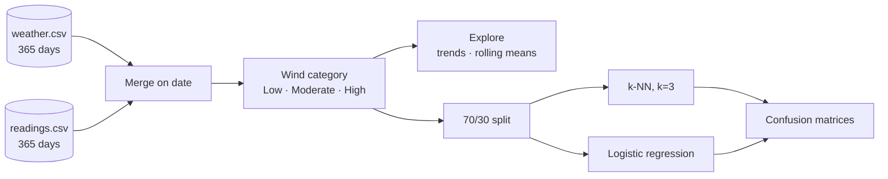
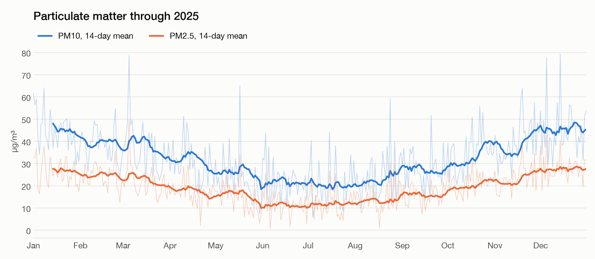
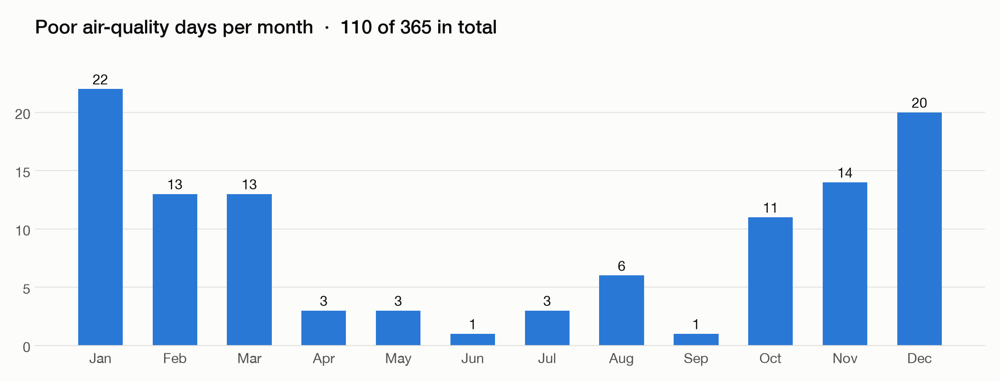
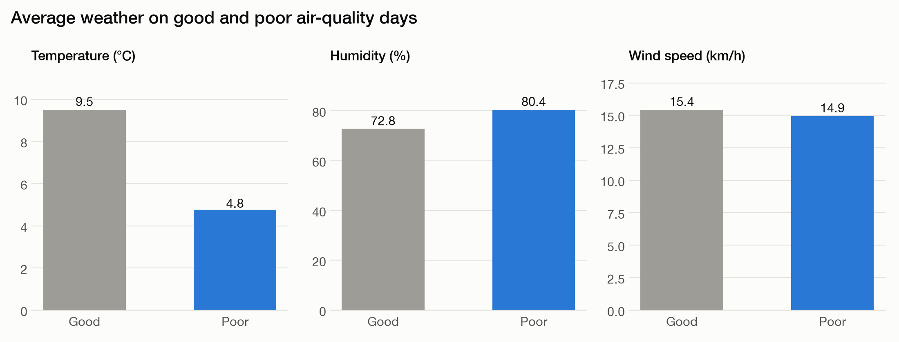
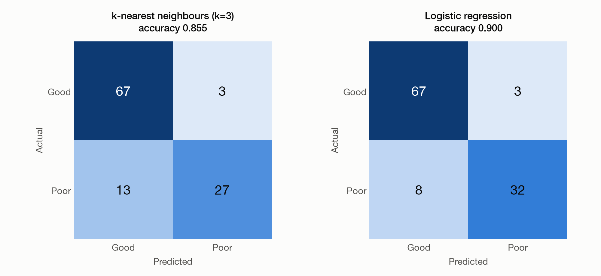

<p align="center">
  
</p>

<h1 align="center">Weather &amp; Air Quality Analysis</h1>

<p align="center">
  <strong>A year of daily weather and pollution readings — and a model that flags poor air days.</strong>
</p>

<p align="center">
  <a href="https://jjmensah.github.io/enam_portfolio/projects/weather-air-quality/"></a>
  
  
  
  
</p>

---

Daily weather (temperature, humidity, wind, rainfall) and air-quality readings (PM10, PM2.5, NO2,
SO2, CO) for 2025 are joined on date, explored for seasonal patterns, and used to train two
classifiers that predict whether a day has **poor air quality**.

## Highlights

- **One clean table.** 365 weather days and 365 readings join one-to-one, with no missing values;
  the date becomes the index.
- **An engineered wind feature.** Wind speed is binned into Low (&lt;10), Moderate (10–20) and
  High (≥20 km/h).
- **Seasonality made visible.** A 14-day rolling mean shows particulates falling from May to
  September and climbing again into winter.
- **Two classifiers compared.** Logistic regression reaches **0.90** accuracy against 0.855 for
  k-nearest neighbours, by catching more of the poor days.

## Pipeline



## Findings

<p align="center"></p>

PM10 stays above PM2.5 all year. Both dip together between May and September.

<p align="center"></p>

110 of 365 days are poor, concentrated in the winter months.

<p align="center"></p>

Poor days are colder (4.8 °C against 9.5 °C) and more humid (80% against 73%); average wind speed
barely differs.

## Results

<p align="center"></p>

| Model | Accuracy | Poor days caught |
| --- | ---: | ---: |
| k-nearest neighbours (k=3) | 0.855 | 27 of 40 |
| Logistic regression | **0.900** | **32 of 40** |

Both models classify good days identically (67 correct, 3 false alarms). The difference is in
recall on poor days.

## Repository layout

```text
.
├── assets/
│   ├── cover.svg
│   └── figures/            # generated by scripts/make_figures.py
├── data/
│   ├── readings.csv
│   └── weather.csv
├── notebooks/
│   └── 01_weather_air_quality_analysis.ipynb
├── reference/
│   └── brief.pdf           # original exam brief
├── scripts/
│   └── make_figures.py
└── requirements.txt
```

## Running it

```bash
python -m venv .venv && source .venv/bin/activate
pip install -r requirements.txt
jupyter notebook notebooks/01_weather_air_quality_analysis.ipynb
```

To regenerate the figures:

```bash
python scripts/make_figures.py
```
